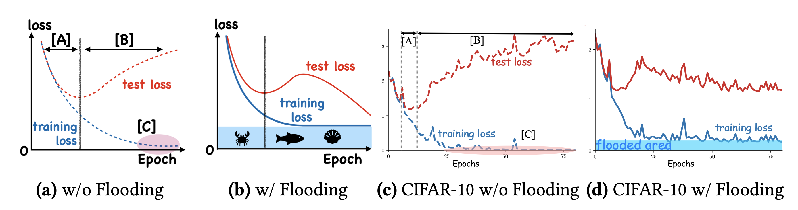

# flooding
Demo code for the flooding regularizer proposed in "[Do We Need Zero Training Loss After Achieving Zero Training Error?](https://arxiv.org/abs/2002.08709)" by Takashi Ishida, Ikko Yamane, Tomoya Sakai, Gang Niu, and Masashi Sugiyama.

## Introduction

Overparameterized deep networks have the capacity to memorize training data with zero training error.
Even after memorization, the training loss continues to approach zero, making the model overconfident and the test performance degraded. Since existing regularizers do not directly aim to avoid zero training loss, they often fail to maintain a moderate level of training loss, ending up with a too small or too large loss.
*Flooding* is a direct solution that intentionally prevents further reduction of the training loss when it reaches a reasonably small value, which is called the flooding level.
Flooding makes the loss float around the flooding level by doing mini-batched gradient descent as usual but gradient ascent if the training loss is below the flooding level.
This can be implemented with one line of code with `flood = (loss-b).abs() + b` and is compatible with any stochastic optimizer and other regularizers.
<!-- With flooding, the model will continue to “random walk” with the same non-zero training loss, and we expect it to drift into an area with a flat loss landscape that leads to better generalization. -->

*Figure: (a) shows 3 different concepts related to overfitting. [A] shows the generalization gap increases, while training & test losses decrease. [B] also shows the increasing gap, but the test loss starts to rise. [C] shows the training loss becoming (near-)zero. We avoid [C] by flooding the bottom area, visualized in (b), which forces the training loss to stay around a constant. This leads to a decreasing test loss once again. We confirm these claims in experiments with CIFAR-10 shown in (c)–(d).*

## Demo

### Requirements
- pytorch 1.3.1
- mlflow 1.5.0

### Getting started
Run the following demo for a simple demonstration of flooding with synthetic datasets.  See the [paper](https://arxiv.org/abs/2002.08709) for the details of the synthetic datasets.

```bash
python run_demo_synth.py
```

You will expect to see two png files saved in your directory which is a visualization of the results with synthetic datasets.